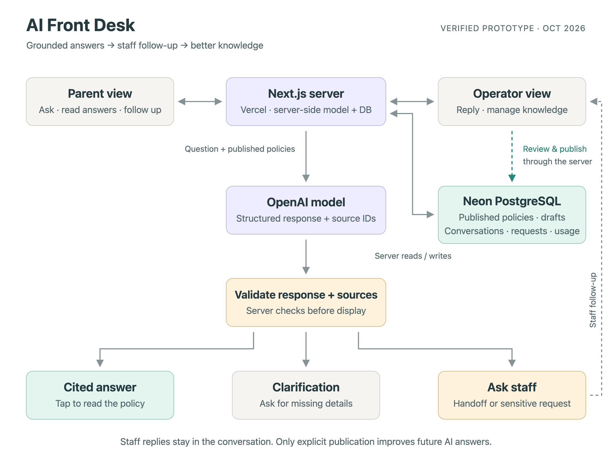

# AI Front Desk for Maple Grove Early Learning Center

A prototype AI front desk for a fictional childcare center. Parents ask everyday questions and get answers grounded only in policies staff have published; staff see every question, reply where the policies fall short, and turn those replies into published knowledge so the next parent gets an answer on the spot.

**Live demo: [bw-frontdesk.vercel.app](https://bw-frontdesk.vercel.app/)**

Two perspectives: `/parent` for families, `/operator` for staff. Each browser gets its own isolated demo session with the seeded handbook, so reviewers never see each other's edits.

## Architecture



One Next.js app on Vercel. A question goes to a server route, which locks the session, saves the parent's message once (retries with the same submission id replay the saved outcome instead of calling the model again), and sends the published handbook plus the last few turns to the OpenAI Responses API with a strict JSON schema.

**The server never trusts the model's shape or its citations.** The model returns exactly one `kind` plus the `source_ids` it claims to have used, and the server validates both before anything reaches the parent:

| Kind        | When                                                             | What the parent sees                                                 |
| ----------- | ---------------------------------------------------------------- | -------------------------------------------------------------------- |
| `answer`    | Published policy settles the question                            | A short answer with source chips that expand the exact policy text   |
| `clarify`   | Necessary context is missing (which child, which day)            | One targeted question, no guess                                      |
| `handoff`   | Policy does not cover it, or a staff decision is needed          | What the policy does say, plus an **Ask staff** offer                |
| `sensitive` | Incident, custody or pickup restriction, billing dispute, staff complaint | A brief acknowledgment and Ask staff; never answered from policy |
| `chat`      | Greeting or thanks                                               | A one-line reply that is not logged as a question                    |

A `source_id` that does not match a published entry, a wrong shape, a timeout, or an over-long answer is a `failure`: the question stays in the conversation with retry, browse policies, or Ask staff. Sources are stored as snapshots, so an old answer still shows what it cited even after the policy changes.

Asking staff creates a tracked request card in the same conversation. Three facts stay separate on purpose: the message was saved, staff progress (reviewing, needs your reply, closed), and whether a service was actually confirmed. No copy implies live staff, a reply deadline, or an approval.

## The improvement loop

A staff reply answers one family. It never changes future answers by itself; the request shows **No Handbook update yet** until an operator opens a draft from it, reviews, and explicitly publishes. Drafts persist but stay out of the parent policy browser and out of the model's grounding until then.

The demo script that exercises the whole loop, verified end to end on the hosted app:

1. "Are you open on Veterans Day?" is a handoff (the seeded closure list does not include it).
2. Staff reply in the conversation. The same question is still a handoff.
3. Staff publish the updated closure list from the request.
4. The next ask is a sourced answer citing the new text.

The operator Inbox defaults to **Needs action**, with an **All** view of every inquiry grouped by conversation and an **Answered on the spot** summary (answered inquiries over eligible inquiries; chat and pending excluded, retries counted once). The Handbook is categorized (Hours, Tuition, Health, Food, Enrollment, Policies, Contact, Other), and a parent can **Start over** into a fresh chat without erasing staff history, earlier requests, or usage counters.

## Limits and failure posture

AI usage is capped server-side at 50 answers per session and 500 per day (configurable). Hitting the cap turns off model calls only: policy browsing, staff requests, and staff replies keep working. With `AI_ANSWERS_ENABLED` unset the app runs with AI answers off and says so in the composer; asking staff still works. A missing key or a failed model call keeps the question in the conversation and offers retry, policies, or staff. Neither is a crash.

All database access and model credentials are server-side. Every read and write is scoped to the active demo session; ids from another session are rejected by every action.

## Running it

```bash
npm install
cp .env.example .env.local      # or: npx vercel env pull .env.local
npm run migrate                 # applies db/migrations/*.sql to DATABASE_URL
npm run dev
```

`.env.local` needs `DATABASE_URL` (local Postgres or Neon), `OPENAI_API_KEY`, `OPENAI_MODEL`, and `AI_ANSWERS_ENABLED=true`. `.env*` is gitignored.

`OPENAI_MODEL` is whatever your API project can use (for example `gpt-4.1-mini`). Reasoning-model controls `OPENAI_REASONING_EFFORT` and `OPENAI_VERBOSITY` default to `low` and are omitted automatically for GPT-4.1 models, which reject them. Set either to an empty string to send nothing.

## Tests

```bash
npm test                        # Vitest, needs DATABASE_URL to a test database
npm run lint && npm run typecheck
```

86 tests run against a real Postgres with stubbed model responses; nothing in the suite calls the live model. They cover observable behavior and state transitions: session isolation, idempotent retries under concurrency, allowance enforcement, source validation and snapshots, request lifecycle, draft-to-publish isolation, Inbox counts and the on-the-spot metric, Start over, and model request compatibility.

## Layout

```
src/app/
  parent/(conversation)/      chat, suggested questions, Start over
  parent/policies/            published handbook, read-only
  operator/(knowledge)/       Handbook editor with categories and drafts
  operator/inbox/             questions and staff requests, filters, summary
  operator/inbox/[id]/        request detail, staff reply, publish from reply
  api/ask/route.ts            claim, ground, call model, validate, persist
  api/requests/route.ts       Ask staff
src/lib/
  answer-service.ts           prompt, JSON schema, response and source validation
  inquiries.ts                idempotent claim, allowance, outcome persistence
  knowledge.ts, knowledge-loop.ts   published entries, drafts, publish from a reply
  requests.ts, conversations.ts, session.ts
  seed-knowledge.ts           the fictional center's ten policies
db/migrations/                additive SQL, applied by scripts/migrate.ts
tests/                        Vitest integration tests
docs/                         architecture diagrams, submission explanation,
                              test inquiries, ADRs, production notes
issues/                       PRD and the per-ticket history of what shipped
```

## Scope notes

The whole published handbook goes into the prompt. Right for ten entries, wrong for five hundred; a real center needs retrieval and per-center answer evals rather than the small live sample checked here per behavior class.

Deferred on purpose: real authentication and multi-center tenancy, live staff presence, email or SMS delivery, document ingestion, streaming answers, and the optional parent decision time. See [docs/production-notes.md](docs/production-notes.md) for what changes in a real deployment.

See [docs/submission-explanation.md](docs/submission-explanation.md) for the one-page rationale and [docs/test-inquiries.md](docs/test-inquiries.md) for the seed text and demo script.
